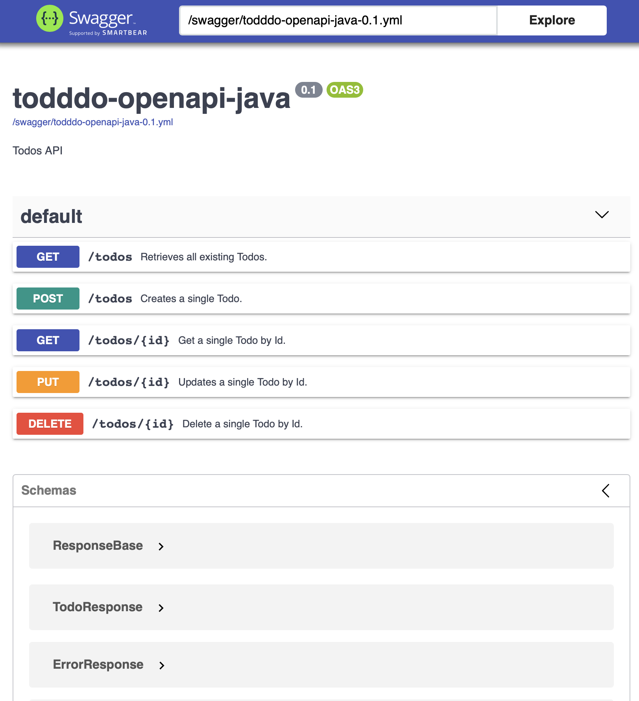
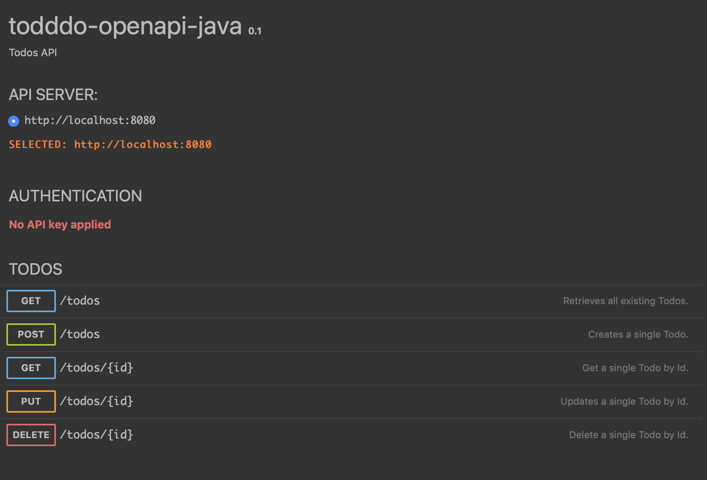

## todddo-openapi-java  

An exploration of modern Java API development by building a non-trivial app with DDD-esque structuring.

Explores:

- [Micronaut](http://micronaut.io) web framework
- [OpenApi](https://www.openapis.org)
- [Gradle](https://gradle.org)
	- Subprojects
	- Configuring dependency constraints
- [Lombok](https://projectlombok.org) for immutable data structures
- [Functional Java](https://www.functionaljava.org) for some FP data structures (`Either`)
- [MapStruct](https://mapstruct.org) for compile-time-safe mapping between data types
- [Gaal native image](https://www.graalvm.org/docs/reference-manual/native-image/) generation
- [Spotless](https://github.com/diffplug/spotless) for enforcing style
- [JaCoCo](https://www.eclemma.org/jacoco/) for test coverage

### Running

* OpenApi at [localhost:8080/swagger-ui](http://localhost:8080/swagger-ui)
	
* RapiDoc at [localhost:8080/rapidoc](http://localhost:8080/rapidoc)
	

The are various ways to run this (consult the Micronaut docs), but I've verified the following 2.

#### On the JVM

`./gradlew check run`

#### As a Graal Native docker image

- `./gradlew build assemble && ./docker-build.sh`
- `docker run -p 8080:8080 todddo-openapi-java` (marvel at the sub 100ms start time)

### Thoughts

#### Micronaut

- Haven't benchmarked, but seems to be quite quick to boot and comes with support for a *lot* of things:
	- OpenAPI
	- DI
	- GraalVM

#### Lombok

- A decent attempt at nice immutable data types, but still, not quite close to modern languages like Scala or Kotlin.

#### Compile-time safety

- Generally better than what I remember it to be from doing Java 10+ years ago
- Micronaut does a great job of trying to make sure things are safe, but:
- Things still break at runtime with certain injections and runtime-reflection based tooling, especially when running
	them in Graal Native
- Java still has a ways to go when it comes to making types ergonomic (unchecked types...)

#### Graal Native

- It took a lot of trial and error to get things like reflection-based tools (Jackson, DI) working *just right*, and to
figure out how to get Swagger resources working (refer to the `native-image.properties` file).

#### Misc.

- Jackson is still yucky compared to any modern JSON tool in Scala, Rust, Haskell, etc. In fact, it's even worse than
Go because the tooling is all reflection based, which means you really have to be careful when trying to use it with
Graal. It took me quite a while to figure out how to appease it.
- Java is still pushing me to use Exceptions for error control flow, but you can get around it with libs like Functional
Java.
